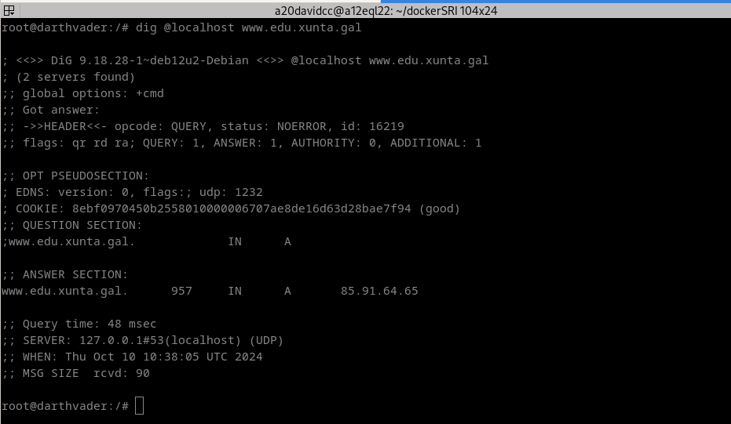
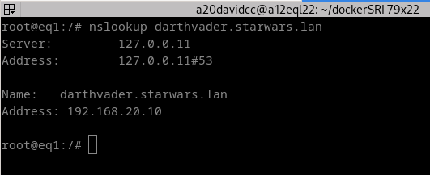
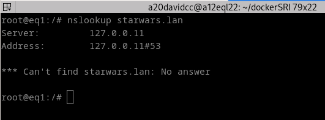
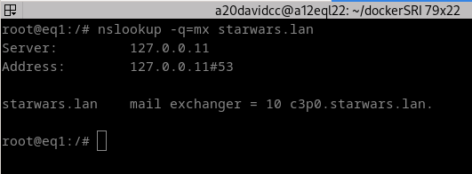
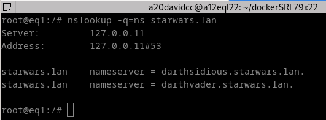
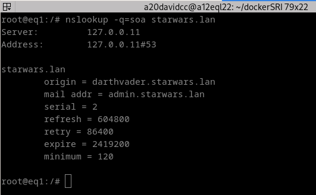
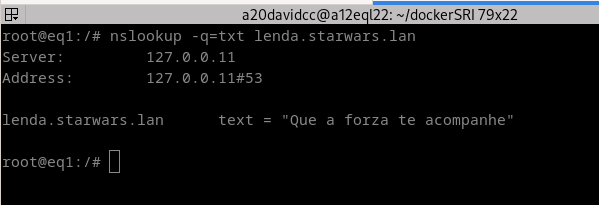
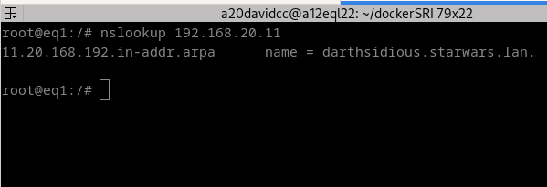

# Instalación de zonas mestras primarias.

## Índice

1. [Comprobación do funcionamento do DNS](#1-comprobación-do-funcionamento-do-dns)
2. [Configuración de reenviadores](#2-configuración-de-reenviadores)
3. [Instalación da zona primaria directa e creación de rexistros](#3-instalación-da-zona-primaria-directa-e-creación-de-rexistros)
4. [Instalación da zona primaria inversa e creación de rexistros](#4-instalación-da-zona-primaria-inversa-e-creación-de-rexistros)
1. [Comprobación dos rexistros](#5-comprobación-dos-rexistros)

## 1. Comprobación do funcionamento do DNS.
Para comprobar que o noso DNS funciona correctamente executamos o seguinte comando.
```bash
dig @localhost www.edu.xunta.gal
```
A salida que obtuvemos de este comando é a seguinte.



Como podemos ver na imaxe, resólveo perfectamente, xa que como nos indica, estamos tendo 1 resposta de 1 consulta que fixemos, ademáis devolve un rexistro tipo A coa IP 85.91.64.65 para www.edu.xunta.gal.


## 2. Configuración de reenviadores.
Para engadir reenviadores ao noso servidor BIND9 teremos que modificar o ficheiro  `named.conf.options`. Neste ficheiro encontraremos un apartado de forwarders que por defecto aparece comentado, teremos que descomentalo eliminando as // do principio da línea e configurar o noso reenviador. 
O ficheiro quedará da seguinte maneira:
```bash
options {
	directory "/var/cache/bind";

	// If there is a firewall between you and nameservers you want
	// to talk to, you may need to fix the firewall to allow multiple
	// ports to talk.  See http://www.kb.cert.org/vuls/id/800113

	// If your ISP provided one or more IP addresses for stable 
	// nameservers, you probably want to use them as forwarders.  
	// Uncomment the following block, and insert the addresses replacing 
	// the all-0's placeholder.

	 forwarders {
	 	8.8.8.8;
	 };

	//========================================================================
	// If BIND logs error messages about the root key being expired,
	// you will need to update your keys.  See https://www.isc.org/bind-keys
	//========================================================================
	dnssec-validation auto;

	listen-on-v6 { any; };
};
```
Para comprobar que esto está funcionando correctamente executaremos este comando:
```bash
dig @localhost www.med.gob.es
```

Esta é a salida que nos mostra:


## 3. Instalación da zona primaria directa e creación de rexistros
O primeiro que temos que facer é crear a zona nun ficheiro chamado `/etc/bind/named.conf.local`. O ficheiro quedará da seguinte forma:
```bash
//
// Do any local configuration here
//

// Consider adding the 1918 zones here, if they are not used in your
// organization
//include "/etc/bind/zones.rfc1918";

zone "starwars.lan" {
    type master;
    file "/etc/bind/db.starwars";
};
```
Como vemos, estamos configurando unha zona chamada *starwars.lan*, que é de tipo máster e que ten como ficheiro `/etc/bind/db.starwars`. Este ficheiro actualmente non existe polo que temos que crealo.
Para iso, podemos copialo a partir dun ficheiro sí existente, o ficheiro `/etc/bind/db.local`. Para copialo executaremos esto:
```bash
cp /etc/bind/db.local /etc/bind/db.starwars
```
A partir de aquí xa podemos comenzar a editalo. O ficheiro quedará da seguinte maneira:
```bash
;
; BIND data file for local loopback interface
;
$TTL 604800
@   IN  SOA darthvader.starwars.lan. admin.starwars.lan. (
            2       ; Serial
            604800  ; Refresh
            86400   ; Retry
            2419200 ; Expire
            120 )   ; Negative Cache TTL

; Hosts Tipo NS
@   IN  NS  darthvader
@   IN  NS  darthsidious

; Hosts Tipo A
darthvader   IN  A   192.168.20.10
skywalker    IN  A   192.168.20.101
skywalker    IN  A   192.168.20.111
luke         IN  A   192.168.20.22
darthsidious IN  A   192.168.20.11
yoda         IN  A   192.168.20.24
yoda         IN  A   192.168.20.25
c3p0         IN  A   192.168.20.26

; Hosts Tipo CNAME
palpatine    IN  CNAME darthsidious

; Hosts Tipo MX
@   IN  MX  10  c3p0

; Hosts Tipo TXT
lenda        IN  TXT "Que a forza te acompañe"
```

## 4. Instalación da zona primaria inversa e creación de rexistros
Como no paso anterior o primeiro que faremos será crear a zona inversa no ficheiro `/etc/bind/named.conf.local`, quedará da seguinte maneira:
 ```bash
//
// Do any local configuration here
//

// Consider adding the 1918 zones here, if they are not used in your
// organization
//include "/etc/bind/zones.rfc1918";

zone "starwars.lan" {
    type master;
    file "/etc/bind/db.starwars";
};

zone "20.168.192.in-addr.arpa" {
    type master;
    file "/etc/bind/db.192";
};
 ```

O seguinte será crear o ficheiro de configuración da zona inversa, podemos executar o mesmo comando que antes para usar o ficheiro `/etc/bind/db.127`. 
```bash
cp /etc/bind/db.127 /etc/bind/db.192
```

O ficheiro da zona inversa quedará da seguinte maneira:
```bash
;
; BIND reverse data file for local loopback interface
;
$TTL	604800
@	IN	SOA	darthvader.starwars.lan. admin.starwars.lan. (
			      1		; Serial
			 604800		; Refresh
			  86400		; Retry
			2419200		; Expire
			 120 )		; Negative Cache TTL
;

;Rexistros NS
@	IN	NS	darthvader.starwars.lan.
@   IN  NS  darthsidious.starwars.lan.

; Rexistros PTR
10	IN	PTR	darthvader.starwars.lan.
101	IN	PTR	skywalker.starwars.lan.
111	IN	PTR	skywalker.starwars.lan.
22	IN	PTR	luke.starwars.lan.
11	IN	PTR	darthsidious.starwars.lan.
24	IN	PTR	yoda.starwars.lan.
25	IN	PTR	yoda.starwars.lan.
26	IN	PTR	cp3p0.starwars.lan.
``` 

## 5. Comprobación dos rexistros.

Faremos todas estas comprobacións dende un equipo cliente.

#### - nslookup darthvader.starwars.lan



#### - nslookup skywalker.starwars.lan


#### - nslookup starwars.lan

Este comando non o resolve xa que non existe ningunha referencia a starwars.local.



#### - nslookup -q=mx starwars.lan



#### - nslookup -q=ns starwars.lan



#### - nslookup -q=soa starwars.lan



#### - nslookup -q=txt lenda.starwars.lan



#### - nslookup 192.168.20.11

