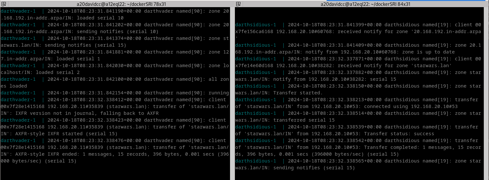
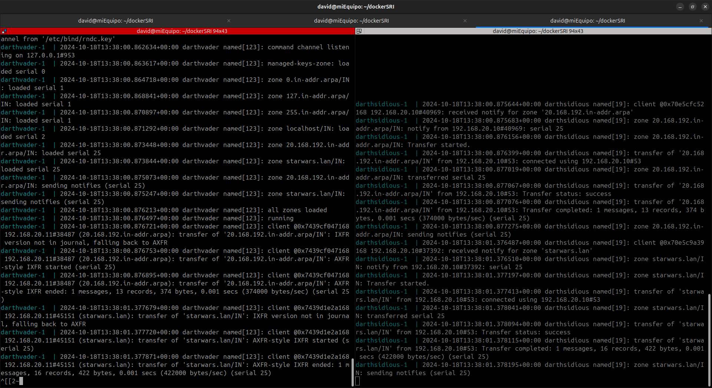
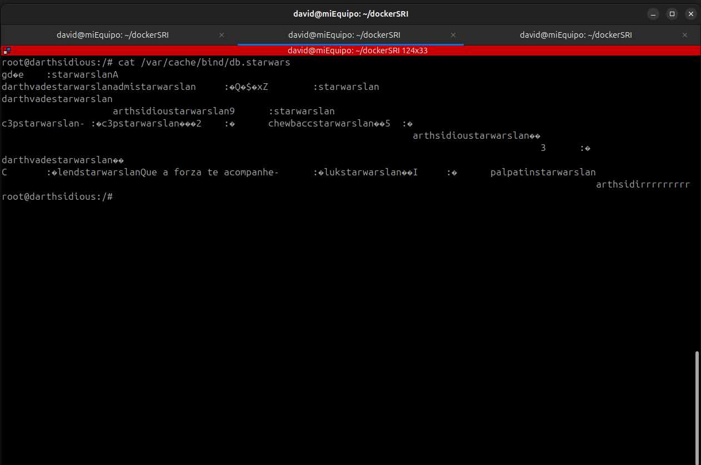
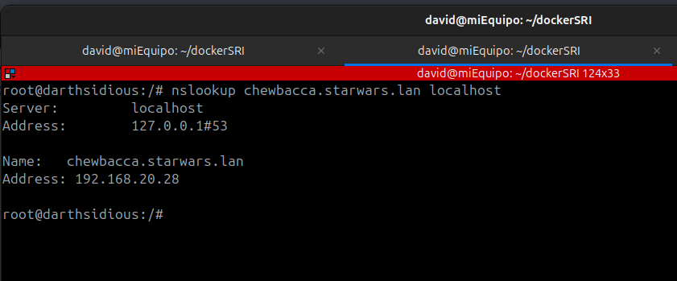
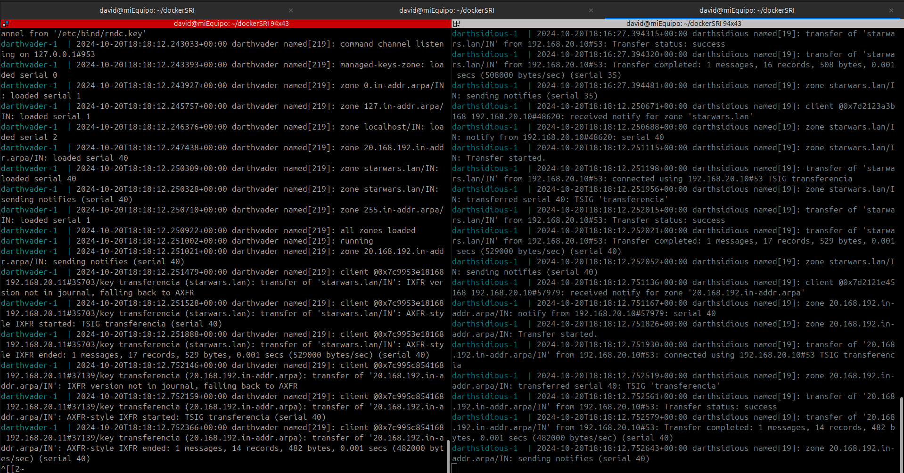
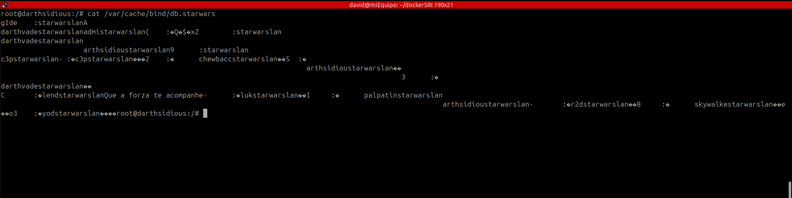

# Instalación de zonas secundarias.

## 1. Configuración de servidor secundario.

O primeiro que faremos será configurar o fichero `named.conf.local` na máquina darthsidious que quedará da seguinte maneira:
```bash
//
// Do any local configuration here
//

// Consider adding the 1918 zones here, if they are not used in your
// organization
//include "/etc/bind/zones.rfc1918";

zone "starwars.lan" {
    type slave;
    file "db.starwars";
    masters { 192.168.20.10; };
};

zone "20.168.192.in-addr.arpa" {
    type slave;
    file "db.192";
    masters { 192.168.20.10; };
};

```

O seguinte será referenciar no ficheiro `named.conf.local` do equipo darthvader o servidor secundario. O ficheiro quedará así:
```bash
//
// Do any local configuration here
//

// Consider adding the 1918 zones here, if they are not used in your
// organization
//include "/etc/bind/zones.rfc1918";

zone "starwars.lan" {
    type master;
    file "db.starwars";
    allow-transfer { 192.168.20.11; };
};

zone "20.168.192.in-addr.arpa" {
    type master;
    file "db.192";
    allow-transfer { 192.168.20.11; };
};

```

Na seguinte captura móstranse os logs dos dous equipos ao reiniciar o servicio bind9, no que podemos ver como se realiza a transferencia de zona:


## 2. Engadindo un novo rexistro tipo A

Engadimos un novo rexistro tipo A no ficheiro `db.starwars` da máquina darthvader, e o seu respectivo punteiro no ficheiro `db.192`. Aquí vemos os logs das dúas máquinas no momento do reinicio do bind9:



Nesta outra captura mostramos o ficheiro de zona desde o servidor darthsidious:


## 3. Comprobación de resolución de nome en servidor secundario.

Neste apartado mostraremos como desde o servidor secundario darthsidious podemos resolver o nome do rexistro tipo A que acabamos de implementar.



## 4. Configuración de chaves.

Ficheiro `named.conf.local` do servidor darthsidious:
```bash
//
// Do any local configuration here
//

// Consider adding the 1918 zones here, if they are not used in your
// organization
//include "/etc/bind/zones.rfc1918";

key "transferencia" {
	algorithm hmac-sha256;
	secret "bD83Et9sdXIfAy4HKqkLVH76cSfpWZKg4N/pMovAAeQ=";
};

server 192.168.20.10 {
    keys { transferencia; };
};

zone "starwars.lan" {
    type slave;
    file "db.starwars";
    masters { 192.168.20.10; };
};

zone "20.168.192.in-addr.arpa" {
    type slave;
    file "db.192";
    masters { 192.168.20.10; };
};
```

Ficheiro `named.conf.local` do servidor darthvader:
```bash
//
// Do any local configuration here
//

// Consider adding the 1918 zones here, if they are not used in your
// organization
//include "/etc/bind/zones.rfc1918";

key "transferencia" {
	algorithm hmac-sha256;
	secret "bD83Et9sdXIfAy4HKqkLVH76cSfpWZKg4N/pMovAAeQ=";
};

zone "starwars.lan" {
    type master;
    file "db.starwars";
    allow-transfer { key "transferencia"; };
};

zone "20.168.192.in-addr.arpa" {
    type master;
    file "db.192";
    allow-transfer { key "transferencia"; };
};
```

Despois de engadir o rexistro tipo A e o punteiro para r2d2, estos son os logs dos dous servidores:



Este é o ficheiro `db.starwars` desde o equipo darthsidious:


